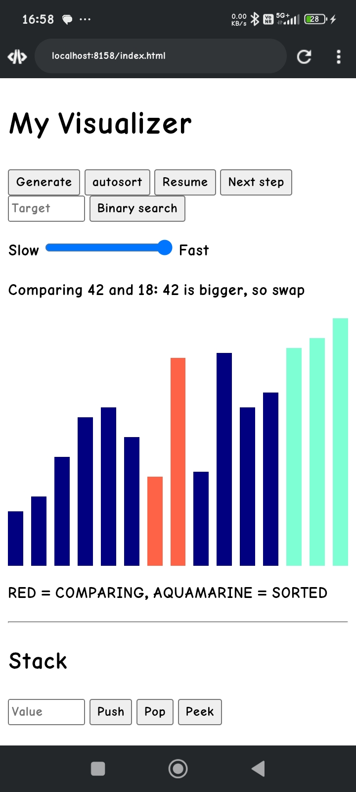
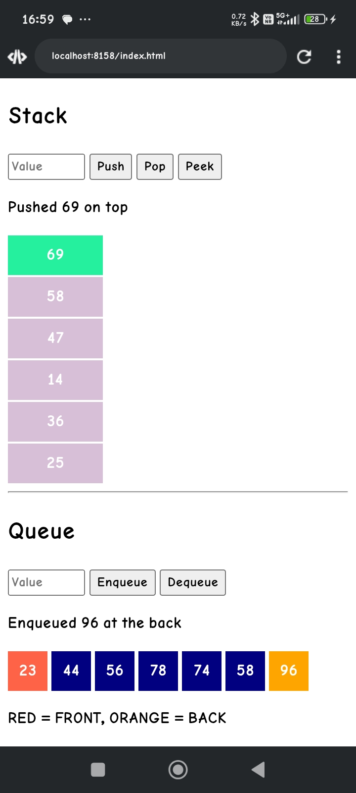

# DSA Visualizer

An interactive tool that shows how data structures and algorithms work, step by step. Built for students who struggle to picture what happens inside the computer, and for teachers who want to explain it visually.

## Features
- Step-by-step visualization of sorting algorithms
- (add: speed control, custom array input, other algorithms, etc.)

## Demo

## How to run
1. Download or clone this repo
2. Open `index.html` in any browser (no installation needed)

## Built with
JavaScript, HTML, CSS

## What I learned
Through this project I learned JavaScript, HTML and CSS, and how sorting algorithms and other DSA concepts work internally. I built it entirely on my phone.

## Author
Ayush Kumar - [LinkedIn](https://www.linkedin.com/in/ayush-kumar-8610a5358)
